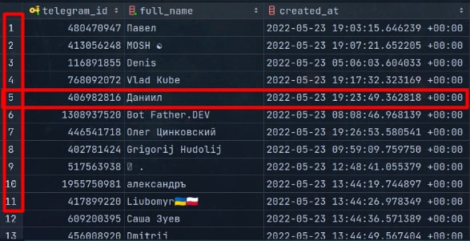

### For full info check this tutorial: [Tutorial](https://www.postgresqltutorial.com/)

This is not a full tutorial, it's just a brief introduction to PostgreSQL and a script for video-tutorial.

# Part 1. Basics.

## How data is stored in PostgreSQL?

- To store information in a database, you need to create a **table**.
- Tables always contain rows and columns. Tables also called _'relations'_
- Rows are called records and contain different data. Also called _'tuples'_.
- Columns separate data in one row by different types. Also called _'fields/attributes'_.
- Rows are horizontal.
- Columns are vertical.

Example of a table:



#### In this example you have 3 columns:

1. telegram_id - integer (bigint / 64bit). _This is the unique identifier of the user in Telegram_.
2. full_name - varchar / string. _Stores full name of the user_.
3. created_at - timestamp (timestamp). _Stores time when the user was added to database_.

### SQL Syntax

Every action in PostgreSQL is performed by some SQL statement. Every statement <u>must be separated</u> by semicolon: `;`

**Most common SQL** statements are written in the following format:

``` 
<action> <table_name> <condition>;

<action> <table_name> <condition>;

<action> <table_name> <condition>;
...
```

> **Note:**
>
> - SQL **commands are case-insensitive**. You can write `SELECT`/`select`/`Select` and all will work.
> - **Indentation is unimportant**. You can put newlines and tabs wherever you want.
> - SQL is very effective for SWIFT storing and retrieving data.

### SQL subtypes:

You can use SQL to manipulate database/table structure and settings, and most often **to manipulate data**.

There are different subtypes of SQL:

- DDL (Data Definition Language) - used to create/alter/drop tables.
- DML (Data Manipulation Language) - used to insert/update/delete data.
- DCL (Data Control Language) - used to grant/revoke privileges for users.
- TCL (Transaction Control Language) - used to start/commit/rollback transactions.

> **Note:**
> - Transactions are used to prevent data loss. You can run multiple SQL statements in one transaction. If one of them
    fails, all of them will be rolled back. This is useful for example when you want to insert data into one table, but
    you don't want to insert data into second table if the first one fails.
> - Priviledges are used to grant/revoke access to different commands for users. You can restrict one user to
    use `INSERT`,
    `UPDATE`, `DELETE` in a table, but allow to `SELECT` data.

### Actions

- `SELECT` - selects data from a table.
- `INSERT` - Creates new records in a table.
- `UPDATE` - updates data in a table.
- `DELETE` - deletes data from a table.
- `CREATE TABLE` - creates a table.
- `DROP TABLE` - drops a table.
- `ALTER TABLE` - alters a table.
- ...

Firstly, to perform some action you need to create a table.

#### To create a table you will need to:

1. Think what data you want to keep track of. _Example: Data about registered users._
2. Think about a name for the table. Better use simple lowercase names. _Example: users_
3. List all variety of data and each datatype (E.g. Python datatype) you want to store. _Example: telegram_id - integer,
   full_name - text, created_at - date and time._
4. Determine what [types of data](https://www.postgresqltutorial.com/postgresql-tutorial/postgresql-data-types/) are
   supported by your database system. _Example: PostgreSQL supports `BIGINT`, `VARCHAR`, `TIMESTAMP`, respectively_.
5. Determine which [constraints](https://www.tutorialspoint.com/postgresql/postgresql_constraints.htm) you want to apply
   to your table. _Example: You can use `PRIMARY KEY` to make sure that each row has a unique and not empty identifier.
   PostgreSQL will throw an error if you try to insert a duplicate identifier. In this example it is `telegram_id`_
6. If you want to create a `PRIMARY KEY` that will be automatically filled `(e.g. 1, 2, 3 ...)`, you can use `SERIAL`
   datatype with `PRIMARY KEY`.
   _Example: `telegram_id SERIAL PRIMARY KEY`_
7. Determine which columns are nullable, and which ones are not. _Example: You can use `NOT NULL` to make sure that
   each row has a `telegram_id` and `full_name`._

> Syntax: `CREATE TABLE table_name (column_name data_type, column_name data_type, ...);`

> **Note:**
>
> You can set the default value of a column by adding a `DEFAULT` clause after the data type.
>
> You can set additional constraints for a column.

#### Data types

- `INTEGER` - integer 32-bit. Same as Python `int` type.
- `BIGINT` - integer 64-bit. Same as Python `int` type.
- `FLOAT` - Same as Python `float` type.
- `BOOLEAN` - Same as Python `bool` type.
- `TEXT` - Same as Python `str` type of unknown length.
- `VARCHAR` - Same as Python `str` type of fixed length.
- `DATE` - Same as Python `datetime.date` type.
- `TIME` - Same as Python `datetime.time` type.
- `TIMESTAMP` - Same as Python `datetime.datetime` type.
- `SERIAL` - An autoincrementing integer (e.g. 1, 2, 3 ...). It will be calculated automatically by PostgreSQL.
- `NULL` - allows to store NULL values. Same as Python `None` type.
- other types.

#### To create a table you need to:

1. Write `CREATE TABLE` command.
2. Then you state the name of the table.
3. Then you open the parenthesis and list all columns:
    1. Column name.
    2. Column type.
    3. Constraints.
4. Then you close the parenthesis.

#### Example

Let's create a table called `users` for storing data about registered telegram users. We will use `BIGINT`
for `telegram_id` instead of `INTEGER` because it has to be 64bit.

```postgresql
CREATE TABLE users
(
    telegram_id BIGINT PRIMARY KEY,
    full_name   VARCHAR,
    created_at  TIMESTAMP DEFAULT NOW()
);
```

##### Response

```
CREATE TABLE
```

## Altering Tables

If you want to edit table structure you can use `ALTER TABLE` command.
You can add, remove or rename columns, or change their data types.

> Syntax:
>
> - `ALTER TABLE table_name ADD column_name data_type;`
> - `ALTER TABLE table_name DROP column_name;`
> - `ALTER TABLE table_name RENAME column_name TO new_column_name;`
> - `ALTER TABLE table_name ALTER column_name SET DATA TYPE data_type;`
> - `ALTER TABLE table_name ALTER column_name SET NOT NULL;`
> - ...

## Dropping Tables

If you want you can delete the entire table with all data.

> Syntax: `DROP TABLE table_name;`

#### Example

```postgresql
DROP TABLE users;
```

## Inserting Data

> Syntax: `INSERT INTO table_name (column_name, column_name, ...) VALUES (value, value, ...);`

#### To insert data into a table you need to:

1. Write `INSERT INTO` command.
2. Then you state the name of the table.
3. Then you list all columns names inside the parenthesis.
4. Write `VALUES`.
5. Then you list all values you want to insert inside the parenthesis.

> **Note:**
>
> - You must enter all values **in the same order** as you listed columns.
>
> - **You can skip filling columns** that will be filled with default (or null) values.

> You must use specified datatypes for each value:
>
>- For example, if you want to insert a `INTEGER` value, you must write
   > `1` instead of `1.0`
>
>  - If you want to insert a `VARCHAR/TEXT` value, you must put a string inside single quotes.
>
>- If you want to insert a `TIMESTAMP` value, you must use the following format:
   > `'YYYY-MM-DD HH:MM:SS'`, where `YYYY` is year, `MM` is month, `DD` is day, `HH` is hour, `MM` is minute, `SS` is
   second.

#### Example

Let's insert one user into the table with name 'John Doe'.

```postgresql
INSERT INTO users (telegram_id, full_name, created_at)
VALUES (123456789, 'John Doe', '2020-01-01 00:00:00');
```

##### Response

```
INSERT 0 1
```

## Selecting Data

> Syntax: `SELECT column_name, column_name, ... FROM table_name WHERE condition;`

#### To select data from a table you need to:

1. Write `SELECT` command.
2. Then you write the name of the column (or several columns separated by commas) you want to select.
3. Then you write `FROM` command.
4. Then you write the name of the table.

> **Filtering data**
>
> If you want to filter data you can use `WHERE` command and write a condition.
>
> Condition is a piece of code that checks if the data is true or false. If the condition is true, the data is selected.
>
> Example: `WHERE telegram_id = 123456789`, where `telegram_id` is the name of the column.


> **Note:**
>
> You can select all columns from a table by writing `*`,
>
but [this is not recommended.](https://www.red-gate.com/hub/product-learning/sql-prompt/finding-code-smells-using-sql-prompt-asterisk-select-list)

#### Example 1:

Let's select all users from the table.

```postgresql
SELECT telegram_id
FROM users;
```

##### Response:

```
telegram_id 
-------------
   123456789
```

#### Example 2:

Let's select all users from the table where their telegram_id is 123456789.

```postgresql
SELECT *
FROM users
WHERE telegram_id = 123456789;
```

##### Response:

```
 telegram_id | full_name |     created_at      
-------------+-----------+---------------------
   123456789 | John Doe  | 2020-01-01 00:00:00
```

## Updating Data

> Syntax: `UPDATE table_name SET column1 = value1, column2 = value2, ... WHERE condition;`

#### To update data in a table you need to:

1. Write `UPDATE` command.
2. Then you write the name of the table.
3. Then you write `SET` command.
4. Then you iterate through the names of the columns and the values you want to set. _
   Example: `telegram_id = 987654321`_
5. Then you write condition if you want to filter data. _Example: `WHERE full_name = 'John Doe'`_

#### Example

Let's update the full name of the user with telegram_id `123456789` to `John Moe`.

```postgresql
UPDATE users
SET full_name = 'John Moe'
WHERE telegram_id = 123456789;
```

##### Response

```
UPDATE 1
```

## Deleting Data

> Syntax: `DELETE FROM table_name WHERE condition;`

#### To delete data from a table you need to:

1. Write `DELETE FROM` command.
2. Then you write the name of the table.
3. Then you write condition if you want to filter data. _Example: `WHERE full_name = 'John Doe'`_

#### Example

Let's delete the user with telegram_id `123456789`.

```postgresql
DELETE
FROM users
WHERE telegram_id = 123456789;
```

##### Response

```
DELETE 1
```
