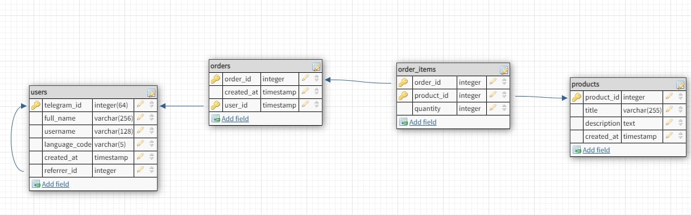

### For full info check this tutorial: [Tutorial](https://www.postgresql.org/docs/current/tutorial-fk.html)

This is not a full tutorial, it's just a brief introduction to PostgreSQL and a script for video-tutorial.

# Part 3. Relationships and JOINS

## Relationships

At some point you will need to store related entities in the database.
These may include:

- Users that somehow relate to other users (Referrals, ...)
- Orders that owned by users
- Items that orders contain

These are better represented by the diagram below:


Here we created 4 interconnected tables:

**users:**

- `telegram_id`
- `full_name`
- `username`
- `language_code`
- `created_at`
- `referrer_id`

**orders:**

- `order_id`
- `user_id`
- `created_at`

**products:**

- `product_id`
- `title`
- `description`
- `created_at`

**order_products:**

- `order_id`
- `product_id`
- `quantity`

Why do we need to create these tables?
Because we need to follow specific rules for the relationship between the tables.

There are 3 types of relationships:

- One-to-one
- One-to-many
- Many-to-many

### One-to-one

One record in one table is related to one record in another table.

> Note: **No duplicates**.

Example (not in our diagram):
Here we have 3 users and each user has a unique password.

```
    |------passwords-----|
    | password | user_id |
    |----------|---------|
    |   123456 |       1 |
    |   123321 |       2 |
    |   483831 |       3 |
    |----------|---------|
```

### One-to-many

One user can have many orders. But one order can belong **only to one user**. This is why we have
a `user_id` column in the `orders` table. We are making each unique order and assigning it to a specific user. There
cannot be two orders with the same `order_id`.

> Note: **Duplicates allowed in the `user_id` column**.

Example:
Here we have a user with the id `1` and he has 3 different orders.

```
    |--------orders------|
    | order_id | user_id |
    |----------|---------|
    |        1 |       1 |
    |        2 |       1 |
    |        3 |       1 |
    |----------|---------|
```

### Many-to-many

Many orders can contain many products and vice versa: any product can be repeated in many orders. This is why
we have a `order_id` and `product_id` columns in separate `order_products` table. We created a separate third table to
allow creating intercrossing links between two tables `orders` and `products`.

> Note: **Duplicates allowed in both columns**.

Example:
Here we have 3 orders with 1 product in 1st, 3 products in 2nd order and 2 products in 3rd order.

```
    |-----order_products----|
    | order_id | product_id |
    |----------|------------|
    |        1 |       1    |
    |        2 |       1    |
    |        2 |       2    |
    |        2 |       3    |
    |        3 |       1    |
    |        3 |       2    |
    |----------|------------|
```

## Foreign keys and Joining tables

Now we need to create these tables with the correct relationships. We need to create a `foreign key` for each table that
references the primary key of the other table.

> **Note:**
>
> To remind you, the primary key is the column that automatically sets the
`NOT NULL` and `UNIQUE` constraints and is used to identify each record.

```
[CONSTRAINT fk_name]
   FOREIGN KEY(fk_columns) 
   REFERENCES parent_table(parent_key_columns)
   [ON DELETE delete_action]
   [ON UPDATE update_action]
```

### Table users:

First, if you have created `users` table from the previous lessons you will need to delete it.

```postgresql
DROP TABLE IF EXISTS users;
```

Now, we will create a new table with the following columns:

```postgresql
CREATE TABLE users
(
    telegram_id   BIGINT PRIMARY KEY,
    full_name     VARCHAR(255) NOT NULL,
    username      VARCHAR(255),
    language_code VARCHAR(255) NOT NULL,
    created_at    TIMESTAMP DEFAULT NOW(),
    referrer_id   BIGINT,
    FOREIGN KEY (referrer_id)
        REFERENCES users (telegram_id)
        ON DELETE SET NULL
);
```

You can see that we have a `referrer_id` column and created a `FOREIGN KEY` for it that references the `telegram_id`
column of the `users` table.

> **Note:**
>
> A setting `REFERENCES users (telegram_id)` makes the postgresql to check if that specified `telegram_id` exists in
> the `users` table. A command with arbitrary `telegram_id` will be rejected.
>
> Also, we have a `ON DELETE SET NULL` setting that automatically sets the `referrer_id` column to `NULL` if the user
> with the specified `telegram_id` is deleted by other commands.

> There are other options for the `ON DELETE` setting, but we will not use them all in this tutorial.
> - `ON DELETE CASCADE` - Will delete the user record if the user with the specified referred record is deleted.
> - `ON DELETE RESTRICT` - Will reject the command to delete **the referrer record**.
> - `ON DELETE NO ACTION` - Will do nothing.
> - `ON DELETE SET DEFAULT` - Will set the `referrer_id` column to the default value if defined.

#### Example:

Let's create a user

```postgresql
INSERT INTO users
    (telegram_id, full_name, username, language_code, created_at)
VALUES (1, 'John Doe', 'johnny', 'en', '2020-01-01');
```

Now we'll add a referral to the user. We will specify the `referrer_id` as `1`:

```postgresql
INSERT INTO users
(telegram_id, full_name, username, language_code, created_at, referrer_id)
VALUES (2, 'Jane Doe', 'jane', 'en', '2020-01-02', 1);
```

Now we can join tables to get the second user and his referrer.

> You can learn about different types of joins in other tutorials. We won't cover them here.

> Syntax: `SELECT table1.column1, ... FROM table1 JOIN table2 ON table2.primary_key = table1.foreign_key`

So we still need to specify the columns that are connecting the tables:

```ON table2.primary_key = table1.foreign_key```

Let's see the user's name and his referrer's name. Since we are connecting 'users' table with itself we also need to
specify the alias for the second table. We will call it 'ref':

```postgresql
SELECT users.full_name AS "user", ref.full_name AS referrer
FROM users
         JOIN users AS ref ON ref.telegram_id = users.referrer_id;
```

##### Response:

```
   user   | referrer 
----------+----------
 Jane Doe | John Doe
 
(1 row)
```

### Table orders:

We need to create a `FOREIGN KEY` for the `user_id` column in the `orders` table.

However, now we specify `ON DELETE CASCADE` for the `user_id` column.
This means that if we delete a user, all his orders will be deleted as well.

```postgresql
CREATE TABLE orders
(
    order_id   SERIAL PRIMARY KEY,
    user_id    BIGINT NOT NULL,
    created_at TIMESTAMP DEFAULT NOW(),
    FOREIGN KEY (user_id)
        REFERENCES users (telegram_id)
        ON DELETE CASCADE
);
```

#### Example:

Let's create an order for the user with the id `1`. We also add `RETURNING` setting to get the new order id:

```postgresql
INSERT INTO orders (user_id)
VALUES (1)
RETURNING order_id;
```

##### Response:

```
 order_id
----------
        1
```

Now let's list all the orders and their owners.

```postgresql
SELECT orders.order_id, users.full_name
FROM orders
         JOIN users ON users.telegram_id = orders.user_id;
```

##### Response:

```
 order_id | full_name 
----------+-----------
        1 | John Doe
        
(1 row)
```

Good! Now it's time to add some products to the order.

### Table products:

First we will create a table for products. It will only contain the info about available products.

```postgresql
CREATE TABLE products
(
    product_id  SERIAL PRIMARY KEY,
    title       VARCHAR(255) NOT NULL,
    description TEXT,
    created_at  TIMESTAMP DEFAULT NOW()
);
```

Now we will need to create a Many-to-Many relationship between the `orders` and `products` tables.
We will do this by creating a `order_products` table.

```postgresql
CREATE TABLE order_products
(
    order_id   INTEGER NOT NULL,
    product_id INTEGER NOT NULL,
    quantity   INTEGER NOT NULL,
    FOREIGN KEY (order_id)
        REFERENCES orders (order_id)
        ON DELETE CASCADE,
    FOREIGN KEY (product_id)
        REFERENCES products (product_id)
        ON DELETE RESTRICT
);
```

You can see that we created two `FOREIGN KEY`'s. Each one references the primary key of the other table.

> We also added `ON DELETE CASCADE` setting to delete the record if the order is deleted.

> We also added `ON DELETE RESTRICT` setting to **reject the command to delete the product** if database contains orders
> with this product.

#### Example:

Let's create a few products.

```postgresql
INSERT INTO products (title, description)
VALUES ('Product 1', 'Description 1'),
       ('Product 2', 'Description 2'),
       ('Product 3', 'Description 3');
```

Let's add these products to the 1st order.

```postgresql
INSERT INTO order_products (order_id, product_id, quantity)
VALUES (1, 1, 1),
       (1, 2, 2),
       (1, 3, 3);
```

Now we need to join the tables to get the products and their owners for each order.

```postgresql
SELECT orders.order_id, products.title as product_name, users.full_name
FROM order_products
         JOIN products ON products.product_id = order_products.product_id
         JOIN orders ON orders.order_id = order_products.order_id
         JOIN users ON users.telegram_id = orders.user_id;
```

##### Response:

```
 order_id | product_name | full_name 
----------+--------------+-----------
        1 | Product 1    | John Doe
        1 | Product 2    | John Doe
        1 | Product 3    | John Doe
        
(3 rows)
```

Now, having the orderd_id you can get all the products for that specific order by adding `WHERE` clause:

```
... WHERE orders.order_id = 1;
```

### Now let's test deletions.

1. Delete the product with the id `1`.

```postgresql
DELETE
FROM products
WHERE product_id = 1;
```

Result:

```
ERROR:  update or delete on table "products" violates foreign key constraint "order_products_product_id_fkey" on table "order_products"
DETAIL:  Key (product_id)=(1) is still referenced from table "order_products".
```

As you see, constraint `ON DELETE RESTRICT` prevents us from deleting the product.

2. Delete the user with the id `1`.

```postgresql
DELETE
FROM users
WHERE telegram_id = 1;
```

Result:

```
DELETE 1
```

We successfully deleted the user, his/her `orders` and `order_products` records by just one command.

```postgresql
select *
from order_products;
```

##### Response:
```
 order_id | product_id | quantity 
----------+------------+----------

(0 rows)
```

Well done! Now you know how to create related tables and how to extract data from them!